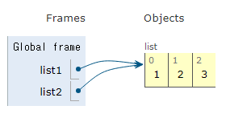

# Copy
## Contents
- [Copy](#copy)
  * [Contents](#contents)
  * [Assignment copy](#assignment-copy)
  * [Copy moduel](#copy-moduel)
    + [Shallow moduel](#shallow-moduel)
      - [Using copy module](#using-copy-module)
      - [Using [:], .copy()](#using------copy--)
    + [Deep copy](#deep-copy)

<small><i><a href='http://ecotrust-canada.github.io/markdown-toc/'>Table of contents generated with markdown-toc</a></i></small>


## Assignment copy
파이썬에서 변수에 값을 할당할 때, 변수는 그 값을 직접 가리키는 것이 아니라 값의 위치(메모리 상의 주소)를 가리키게 되고, 이를 `바인딩`이라고 한다.
- 이 변수와 값 사이에 단순한 연결을 의미.

가변(mutable) 컬렉션(예: list, dictionary)이나 컬렉션 내부의 가변 항목들(list 내부의 요소)을 다룰 때 이들은 값이 변할 수 있기 때문에 주의가 필요하다.   


| collection | 변경 가능 여부 | 순서 여부| 
|-----| ----- |-----|
|str|X|O|
|list|O|O|
|tuple|X|O|
|dict|O|X|
|set|O|X|

```python
# 리스트 생성
list1 = [1, 2, 3]

# list1을 list2에 할당
list2 = list1

# list2의 첫 번째 요소 변경
list2[0] = 10

# 출력
print(list1)  # [10, 2, 3]
print(list2) # [10, 2, 3]

# id(Return the “identity” of an object.)
id(list1) # 2202536250368
id(list2) # 2202536250368
```
<!-- 
 -->


`list1`을 `list2`에 할당한 후 `list2[0]`을 변경하면 `list1`도 함께 변경됨.  
📌 `list1`과 `list2`가 동일한 리스트 객체를 참조하기 때문!

## Copy moduel
복사(copy)를 통해 원본 데이터의 변경을 방지하려고자 한다면 다음과 같이 작성.

### Shallow moduel
#### Using copy module
```python
from copy import copy
list1 = [1, 2, 3]
list2 = copy(list1)
list1[1] = 5

print(list1) # [1, 5, 3]
print(list2) # [1, 2, 3]

id(list1) # 2600865425856
id(list2) # 2600865425856
```

<!--  -->


#### Using [:], .copy()
```python
list1 = [1,2,3]
list2 = list1.copy() # .copy() 사용
list3 = list1[:] # [:] 사용
id(list1) # 2600865760320
id(list2) # 2600865760128
id(list3) # 2600865760576

list1[0] = 0
print(list1, list2, list3) # [0, 2, 3] [1, 2, 3] [1, 2, 3]
```
<!--  -->
  


```python
from copy import copy
list1 = [1,2,[3,4]] 
list2 = copy(list1)
list3 = list1.copy()
list4 = list1[:]

id(list1) # 2600865425856
id(list2) # 2600865760320
id(list3) # 2600865760128
id(list4) # 2600865760576

list1[2][0] = 0
print(list1) # [1, 2, [0, 4]]
print(list2) # [1, 2, [0, 4]]
print(list3) # [1, 2, [0, 4]] 
print(list4) # [1, 2, [0, 4]]
```
Shallow copy라고 부르는 이유는 얕은 복사는 원본 객체를 복사할 때, 객체 자체는 새로 생성하지만 내부의 객체(들)은 참조로 복사하기 때문이다.
<!--  -->
  

따라서 중첩 리스트와 같이 안에 있는 내용을 바꾸려고 하면 내용이 다 바뀌게 된다.
<!--  -->
  


### Deep copy
깊은 복사(deep copy)는 원본 객체를 새로 복제하면서, 객체 안에 있는 모든 객체들도 새로 복제한다.  
따라서 원본 객체와 복사본은 완전히 독립적인 객체들이 된다.

```python
import copy
original_list = [1, [2, 3], 4]

# 깊은 복사
deep_copy_list = copy.deepcopy(original_list)

# 수정
original_list[1][0] = 10
deep_copy_list[1][1] = 20

print(original_list) # [1, [10, 3], 4]
print(deep_copy_list) # [1, [2, 20], 4]
```
<!--  -->
  